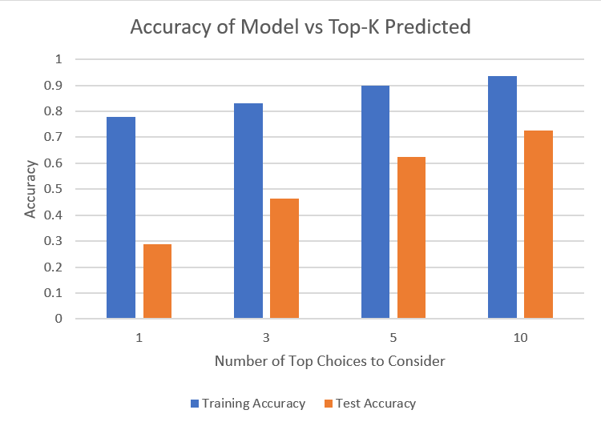

## Status Video
------------------

## Project Summary
------------------
The purpose of this project is to create a model that, given music as training data, can recreate music of the same genre given a musical start (around 10 notes). The type of music generated will depend largely on the type of music trained on. For example a model trained on Bach will yield Bach-esque results, while other models might have different characteristics. Once this music is generated, we then use Malmo to create a series of note blocks that the agent can play in order to play the music on the Minecraft platform. With the final result of this project, our model can recreate music that is similar to the trained music, with a fair degree of musicality.
  
A baseline that we seeked to improve on was simply picking notes at random in order to recreate music. Since such a model would have no sense of what might make sense with a given context, a ML component was necessary in order to adapt the model to the pleasing combinations of notes. By doing so, our model was better able to anticipate which notes would be logical to play next, drawing inspiration entirely from the previous notes that it has seen.

## Approaches
-------------

### Baselines
-------------
In the beginning of the project, we used a model that selects notes in a completely random manner, from any possible note. However, we realized that this was not a very fair comparison, as there was a huge disparity in the notes being selected, and there was no reasonable way for the notes to sound musical. Thus since we start the song with the first ten notes of the original song, we only selected random notes out of the pool of notes that we already saw in that ten-note intro. By doing this, we saw a slight improvement in the baseline, though it still sounded far worse than our own finalized model, which is good.

### Random Forest
-----------------
The Random Forest was the model that we began with, and it turned out to be the model that we had the most success with. The way we set up the model was in a "sliding window" type of sampling. We began the model with the first ten notes of a song, and used those ten notes to predict the next note. Once that note is predicted, we then drop the first note, append the new note to the end, and repeat the process with our new ten-note sample. Since the model was so simplified, it was easy to prototype changes to the model and test them rapidly. However, while this model gave us the most consistently pleasing results, it did have some drawbacks. Since the model was merely a number of decision trees, it does not have the capability to track long-term patterns in the music, and relies solely on the previous ten notes to determine the new note. Something like a Recurrent Neural Network (RNN) might work better for this purpose, but the RNN that we tried sounded worse than the Random Forest in our testing.

### Recurrent Neural Network
----------------------------

### SVM and other models
------------------------

## Evaluation
-------------
In the first iteration of this project, for the evaluation function, we simply took a ten-note start of a song and predicted it as we would normally. Then, using a hit or miss strategy, if the note was identical to the expected note, the model would gain a point, and if it was not identical, the model would not gain a point. However, this mode of evaluation was lacking, as it is possible that the second most likely choice would be the correct note for the situation, and the evaluation is simply skipping it since it is not the dominant decision. Thus for this next iteration, we focused on relaxing this very strict "hit/miss" criteria, and checking the less likely options of the model as well to ensure that the correct note was not just "hiding" behind the more likely note. 
  
Thus, we also tested the accuracy of the model when the top K choices are consided, with the tested Ks being 1, 3, 5, and 10. As expected, when we relax this criteria, the model's accuracy improves, and we see a closer resemblance to the original song.

  
By looking at this graph, we can see that we were indeed getting a reasonably accurate prediction for our randomly chosen song. 

## References
-----------------
- [Music21](https://web.mit.edu/music21/) : Python library to facillitate note and midi parsing
- [Malmo XML Documentation](https://microsoft.github.io/malmo/0.30.0/Schemas/Types.html) : helpful for learning about the formatting of XML mission strings
- [scikit learn](https://scikit-learn.org/stable/) : Python library to handle much of the ML components
- [Karpathy article about RNNs](http://karpathy.github.io/2015/05/21/rnn-effectiveness/) : article describing the effectiveness of RNNs on a variety of applications
