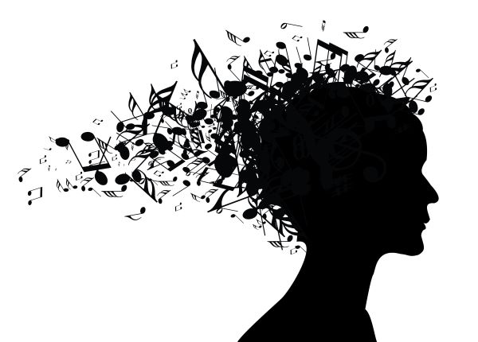

Source code: https://github.com/jens321/MuseAI

Reports:

- [Proposal](proposal.html)
- [Status](status.html)
- [Final](final.html)

### Summary

The purpose of this project is to create a model that, given music as training data, can recreate music of the same genre given a musical start (around 10 notes). The type of music generated will depend largely on the type of music trained on. For example a model trained on Bach will yield Bach-esque results, while other models might have different characteristics. Once this music is generated, we then use Malmo to create a series of note blocks that the agent can play in order to play the music on the Minecraft platform. Some of the challenges that arise with this type of project is ensuring that the model can keep track of long-term patterns in the music in order to create logical progressions and avoid local loops.
