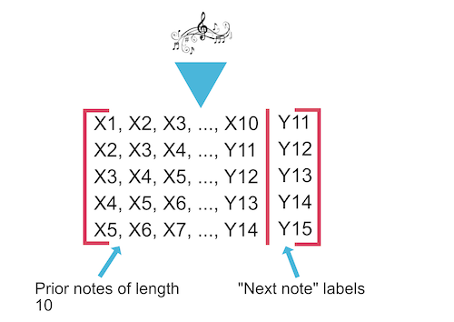
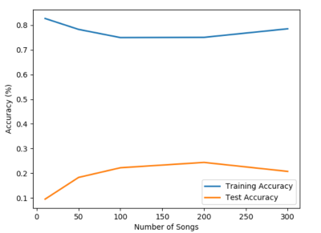

## Status Video
------------------
<iframe width="560" height="315" src="https://www.youtube.com/embed/03MXh7EjNok" frameborder="0" allow="accelerometer; autoplay; encrypted-media; gyroscope; picture-in-picture" allowfullscreen></iframe>

## Project Summary
------------------
The purpose of this project is to create a model that, given music as training data, can recreate music of the same genre given a musical start (around 10 notes). The type of music generated will depend largely on the type of music trained on. For example a model trained on Bach will yield Bach-esque results, while other models might have different characteristics. Once this music is generated, we then use Malmo to create a series of note blocks that the agent can play in order to play the music on the Minecraft platform. Some of the challenges that arise with this type of project is ensuring that the model can keep track of long-term patterns in the music in order to create logical progressions and avoid local loops. The final scope of this project should be a model that can accurately create examples of a given genre of music, depending on the training.

## Approach
-----------
For the technical components of the project, we make use of scikit learn's Random Forest package to serve as the primary model for the project. A decision we had to make was how to set up the dataset to allow for the best training results. In our testing, the best results were had when using the 10 previous notes in order to predict the last note, updating what we had predicted so far as new information is predicted. This allows the model to follow the general trend of the trained music, while sacrificing some of the long-term pattern awareness that we were shooting for.
  
For a more detailed description of how the dataset was created, we can look at the following diagram: 

The music notes at the top represent our list of about 160 training songs (80% of the total 200 songs). These get converted into their respective pitches, which are represented as integers in the code. We then have a sliding window of length 10 for each list of notes (each song is represented as a list of notes) and fill in the structure shown in the diagram. For example, in the first entry, we have the 10 first notes of the song, followed by the 11th note (Y11), which is the label for that training entry. This is then followed by an entry that starts with the second note (X2) and ends with the previously newly predicted note, and predicts the 12th note. We then follow this process for all songs in the training set, which yields the full structure show in the diagram above.  
  
We chose the random forest architecture as a starting point to allow for rapid testing, but we will likely be shifting to a more neural-network-oriented approach, as this will allow the generated music to have better long-term coherence. Since random forests are a very simplified way to approach the problem, this is not a possibility in the  project as it currently stands. 

## Evaluation
-------------
Since the project is primarily in the category of art, it is difficult to come up with an accurate evaluation metric that will describe the "musicality" of a piece with reliability. However the metric we chose consists of testing the generated piece of music against a holdout set of notes, in order to compare how similar they are. For our simplified evaluation criteria, we are using a simple "on or off" approach. If the predicted note is precisely the same note of the validation note, then the model is given a point for accuracy, otherwise it receives no points for that note. 
  
This is the not the most accurate method of evaluating the function, but it allows us to get an idea of how similar our piece is to another piece of the same genre. As the number of pieces on which the model trains increases, the accuracy of the model also increases, albeit much more slowly than should be optimal. This graph illustrates the increase of the accuracy with an increase of trained pieces:
  

  
As we can see from the graph, an increase in the number of musical pieces that the model trains on yields an improvement in the accuracy of the model, to a certain point. After training on more than approximately 200 songs, the test accuracy goes down, indicating that the model might be overtraining on the songs. A way to avoid this might be to train on more diverse pieces of music, to discourage the model from getting too specialized on a certain type of song. In addition, increasing the number of estimators for the random forest would allow us to reduce the overfitting, and allow for a less specialized, but more generalizeable model that can predict a wide variety of songs with decent accuracy.

## Remaining Goals and Challenges
---------------------------------
To reach this status report milestone, we focused more on much of the logistics of integrating the music into Minecraft and Malmo, and less on refining the machine learning algorithms. Our current project is limited because it lacks a lot of the refinement that comes with optimizing the ML components of the project. For example, the project currently only trains on the soprano parts of songs, whereas the actual song might have 3 or 4 parts that are playing in unison. A logical next step might be to find a way to intelligently train on the other parts of the song while still maintaining a coherence with the song as a whole.
  
In addition, as our project currently stands, we use a simplified model for the generating of new music, namely a random forest. This method has its drawbacks, and an RNN might simplify the training or coherence aspects greatly. Thus, the next step might be to shift to a more neural-network oriented model, which has been shown to have better results, especially in the music generation field.
  
Finally, the evaluation metric that we used for this status report is very simplified, and may not represent the true "musicality" of the generated piece. Currently, to evaluate the success of a generated piece of music, we compare each note individually to the notes of a piece of music which we have not trained on. If the note is identical to the note in the validation piece, then that would count as a "hit", which is equivalent to an accurate note. Otherwise the note would register as a "miss", and is given 0 credit for accuracy. However, this is merely a measure of the success of the model to recreate a piece exactly, whereas we might be more interested in evaluating the overall musicality of a piece. Therefore another future step might be to change the evaluation function such that it rewards notes in the same key, or notes that are similar to the validation notes.

## Resources Used
-----------------
- [Music21](https://web.mit.edu/music21/) : Python library to facillitate note and midi parsing
- [Malmo XML Documentation](https://microsoft.github.io/malmo/0.30.0/Schemas/Types.html) : helpful for learning about the formatting of XML mission strings
- [scikit learn](https://scikit-learn.org/stable/) : Python library to handle much of the ML components
- [Karpathy article about RNNs](http://karpathy.github.io/2015/05/21/rnn-effectiveness/) : article describing the effectiveness of RNNs on a variety of applications
